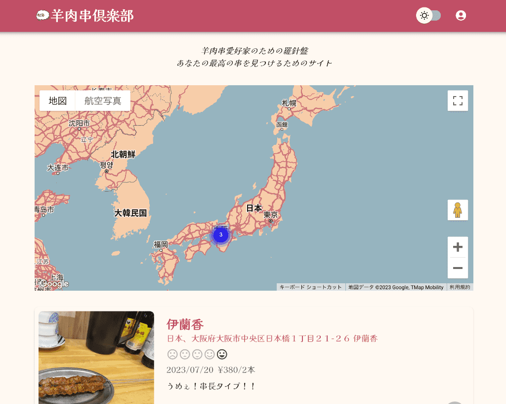

# yangrouchuan.love

## 概要

-   羊肉串が好きなので、その美味しさを共有するためにこのサイトを作成しました。
-   中華料理店に入って羊肉串がなかったという経験を何度もし、そのたびに失望してきたため、このサイトで目当ての店舗に羊肉串が提供されているかを確認できるようにしました。
-   個人開発というメリットを活かして、新しい技術やサービスを積極的に取り入れ活用しています。

## アーキテクチャ

## 機能

### ログイン機能

-   Clerk を使用しています。
-   Clerk 経由で Google アカウントでログインできます。

### 投稿/編集/削除機能

-   羊肉串のレビューを投稿できます。
-   店舗名、5 段階評価、ひとこと、価格、串数、画像を投稿できます。
-   店舗名検索は Google の Place API を使用して実装しています。
-   画像は Cloudflare Images にアップロードしています。
-   フォーム全体のバリデーションは react-hook-form と zod を使用しています。

### 投稿店舗一覧表示機能

-   投稿された店舗の一覧を Map 上に表示しています。
-   店舗名をクリックすると、投稿詳細ページに遷移します。
-   zoom out 時には、クラスタリングされます。
